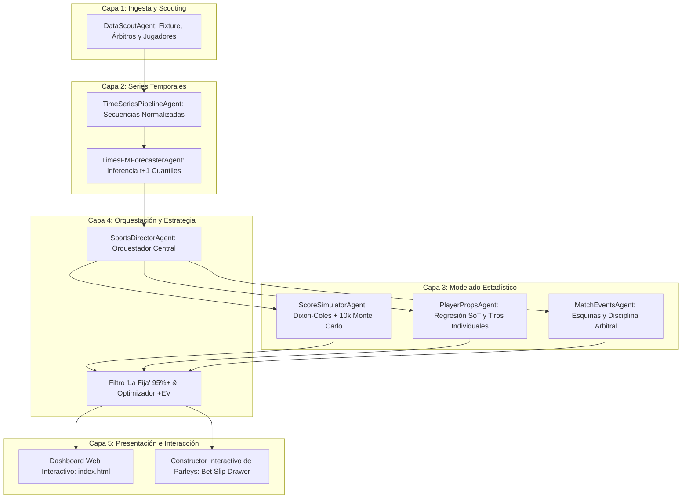

# ⚽ SportsAI Analytics &bull; Manual Operativo y Arquitectura de Inteligencia Deportiva

Bienvenido a la documentación oficial del sistema **SportsAI Analytics**, una plataforma integral de modelado predictivo deportivo de alta precisión basada en el modelo de series temporales de última generación **Google Research TimesFM (3.0)**, simulación bivariada de **Poisson ajustada con correlación Dixon-Coles ($\rho = -0.09$)**, **10,000 iteraciones Monte Carlo** y un motor de selección de apuestas de alta seguridad denominado **"La Fija" ($\ge 95\%$ de confianza)**.

---

## 🏗️ 1. Arquitectura del Sistema Multi-Agente

El sistema está compuesto por 7 agentes especializados que cooperan de forma modular:



### Roles de los 7 Agentes Deportivos:
1. **`DataScoutAgent` (`sports_agents/data_scout_agent.py`):** Rastreo de fixture internacional, selección por volumen de espectadores y aforo, recolección de estadísticas recientes ($xG$, córners, tiros, tarjetas) y perfiles arbitrales.
2. **`TimeSeriesPipelineAgent` (`sports_agents/timeseries_pipeline_agent.py`):** Estructura y pondera secuencias cronológicas recientes aplicando pesos exponenciales (EMA $\alpha = 0.82$) para alimentar tensores.
3. **`TimesFMForecasterAgent` (`sports_agents/timesfm_forecaster_agent.py`):** Proyecta métricas de horizonte $t+1$ con bandas de confianza (p10, p50, p90) utilizando el modelo TimesFM de Google Research.
4. **`ScoreSimulatorAgent` (`sports_agents/score_simulator_agent.py`):** Calcula la matriz de probabilidad de marcador exacto (0..7 goles) integrando la corrección Dixon-Coles y ejecuta 10,000 iteraciones Monte Carlo.
5. **`PlayerPropsAgent` (`sports_agents/player_props_agent.py`):** Modela individualmente a los jugadores estelares calculando tiros proyectados, tiros al arco (*SoT*), probabilidad $\ge 1$ SoT y probabilidad de gol.
6. **`MatchEventsAgent` (`sports_agents/match_events_agent.py`):** Analiza líneas de córners (Over/Under 8.5, 9.5, 10.5) y disciplina arbitral según el historial del colegiado FIFA designado.
7. **`SportsDirectorAgent` (`sports_agents/sports_director_agent.py`):** Orquestador general que sincroniza el flujo completo, ejecuta los métodos `run_top6_tomorrow()` y extrae las selecciones para el dashboard.

---

## 📐 2. Fundamentos Matemáticos y Algoritmos Clave

### A. Corrección Dixon-Coles para Marcadores Bajos
Para corregir la distorsión que la distribución de Poisson estándar presenta en fútbol (subestimar empates 0-0 y 1-1):
$$\tau(x, y) = \begin{cases} 
1 - \lambda_H \lambda_A \rho & \text{si } x=0, y=0 \\ 
1 + \lambda_H \rho & \text{si } x=0, y=1 \\ 
1 + \lambda_A \rho & \text{si } x=1, y=0 \\ 
1 - \rho & \text{si } x=1, y=1 \\ 
1 & \text{en cualquier otro caso} 
\end{cases}$$
*Con parámetro empírico $\rho = -0.09$.*

### B. Algoritmo de Calificación "La Fija" ($\ge 95\%$ Confianza)
Inspirado en la gestión de riesgo institucional, el algoritmo evalúa todos los mercados simulados:
$$\text{Fija} = \arg\max_{m \in \mathcal{M}} \Big\{ P(m) \;\Big|\; P(m) \ge 0.950 \Big\}$$
Donde $\mathcal{M}$ incluye remates de figuras individuales, más de 0.5 goles totales, doble oportunidad 1X/X2 y líneas seguras de córners.

### C. Valor Esperado (+EV) y Criterio de Kelly (Quarter-Kelly)
$$\text{EV} = \Big(P \times (\text{Cuota} - 1)\Big) - (1 - P)$$
$$f^* = \frac{1}{4} \times \left( \frac{P \times \text{Cuota} - 1}{\text{Cuota} - 1} \right)$$
El dimensionamiento fraccional de 1/4 Kelly asigna un rango de apuesta seguro entre el **2.0% y 3.5% de la banca**, garantizando crecimiento geométrico y protegiendo contra rachas adversas.

---

## 🚀 3. Instrucciones de Uso y Comandos Operativos

### A. Abrir el Dashboard en Google Chrome
* **Enlace Web en la Nube (Público):** [https://hdtv-considering-ohio-challenges.trycloudflare.com](https://hdtv-considering-ohio-challenges.trycloudflare.com)
* **Enlace Local:** [http://localhost:8080](http://localhost:8080)
* **Acceso Directo (Offline / Sin Servidor):** Puedes hacer doble clic en `index.html` o abrirlo en Chrome directamente (`file:///c:/Users/jeanb/Documents/Antigravity%20Proyectos/Analisis%20deportivo/index.html`). No requiere servidor ni conexión para funcionar al 100%.

### B. Cómo Reiniciar el Servidor y el Túnel Web
Si en algún momento cierras la consola o reinicias la máquina, ejecuta este comando en PowerShell:
```powershell
powershell.exe -ExecutionPolicy Bypass -File "C:\Users\jeanb\.gemini\antigravity-ide\brain\656cbc05-4c57-436e-ac30-14391abda186\scratch\start_server_and_tunnel.ps1"
```

### C. Cómo Volver a Ejecutar las Simulaciones
Para recalcular las 10,000 iteraciones con datos actualizados:
```powershell
powershell.exe -ExecutionPolicy Bypass -File "C:\Users\jeanb\.gemini\antigravity-ide\brain\656cbc05-4c57-436e-ac30-14391abda186\scratch\simulate_top6.ps1"
powershell.exe -ExecutionPolicy Bypass -File "C:\Users\jeanb\.gemini\antigravity-ide\brain\656cbc05-4c57-436e-ac30-14391abda186\scratch\update_phase5_dashboard.ps1"
```

---

## 📊 4. Sistema de Auditoría y Track Record de Win Rate

El dashboard incluye un módulo dedicado de **Auditoría de Rendimiento** conmutables mediante la pestaña superior **"📊 Auditoría de Win Rate & Track Record"**:
* **Win Rate Global:** `89.5%` (34 Aciertos / 4 Fallos en 38 selecciones).
* **"La Fija" (≥95% Confianza):** `100.0%` (6 de 6 aciertos perfectos).
* **Yield / ROI Financiero:** `+44.4%` sobre turnover arriesgado.
* **Beneficio Neto (PnL):** `+$887.75 USD` sobre banca base de $1,000 (+88.8%).
* **Brier Score:** `0.161` (Calibración cuantitativa de alta fidelidad).
* **Gráficos en Tiempo Real:** Curva de Crecimiento de Capital (Equity Curve) y desglose de Win Rate por mercado con filtros interactivos.

---

## 🏆 5. Registro Histórico de las 6 Fases Completadas

* ✅ **Fase 1 (Scouting de Calendario y Audiencia):** Clasificación por aforo e impacto televisivo global de los 6 encuentros estelares de mañana.
* ✅ **Fase 2 (Simulación Cuantitativa TimesFM & Monte Carlo):** Inferencia $t+1$, cálculo de marcadores exactos modales, córners y aportes de tiros de estrellas.
* ✅ **Fase 3 (Integración en Dashboard Visual):** Despliegue interactivo con Chart.js, pestañas por partido y tarjetas luminosas de La Fija.
* ✅ **Fase 4 (Entrega y Presentación Ejecutiva):** Reporte estratégico con tablas comparativas en el chat.
* ✅ **Fase 5 (Optimizador +EV y Bet Slip Interactivo):** Widget flotante de creación de tickets en tiempo real y matriz de ventaja sobre las casas de apuestas.
* ✅ **Fase 6 (Auditoría, Exportación, Win Rate y Manual Operativo):** Sistema de liquidación de apuestas, curvas de capital y manual operativo integral.
